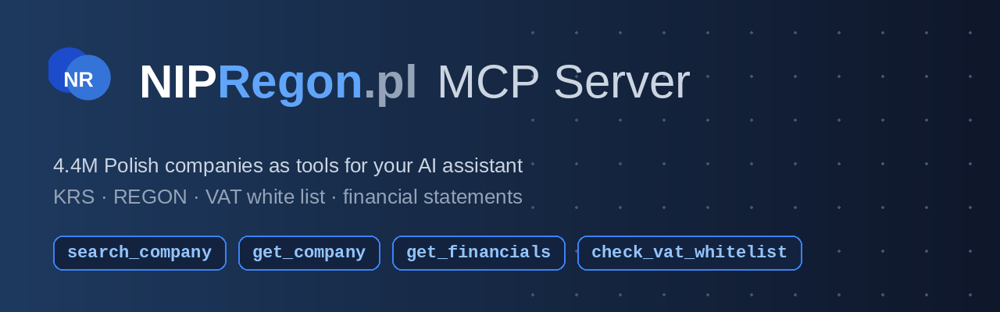
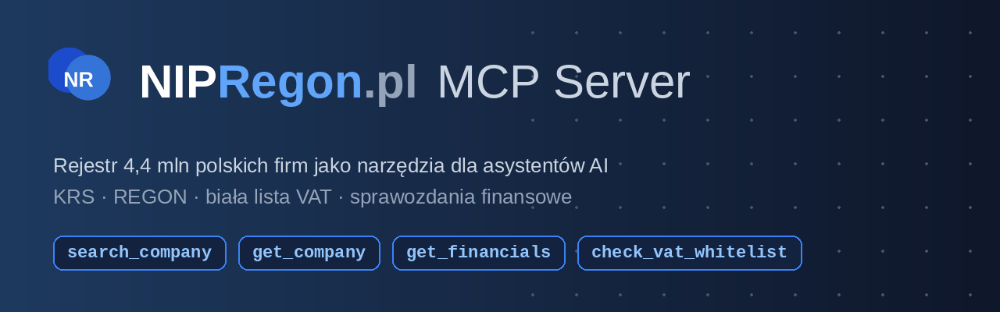

# NIPRegon MCP Server

Look up **Polish companies** from any AI assistant: registry data (KRS, REGON,
CEIDG), VAT white list checks before payments, and financial statements of
4.4M Polish businesses.

Backed by [NIPRegon.pl](https://nipregon.pl): data sourced exclusively from
official public registers (KRS, REGON, CEIDG, the Ministry of Finance VAT
white list and financial statements filed with the National Court Register).

[](LICENSE)
[](https://nipregon.pl/mcp)
[](https://registry.modelcontextprotocol.io/v0/servers?search=nipregon)

[](https://cursor.com/en/install-mcp?name=nipregon&config=eyJ1cmwiOiJodHRwczovL2FwaS5uaXByZWdvbi5wbC9tY3AifQ==)
[](https://insiders.vscode.dev/redirect/mcp/install?name=nipregon&config=%7B%22type%22%3A%22http%22%2C%22url%22%3A%22https%3A%2F%2Fapi.nipregon.pl%2Fmcp%22%7D)

## Remote server (recommended)

One endpoint, zero install:

```
https://api.nipregon.pl/mcp
```

Generic config that works in most MCP clients:

```json
{
  "mcpServers": {
    "nipregon": {
      "type": "http",
      "url": "https://api.nipregon.pl/mcp"
    }
  }
}
```

<details>
<summary><b>Claude Code</b></summary>

```bash
claude mcp add --transport http nipregon https://api.nipregon.pl/mcp
```
</details>

<details>
<summary><b>Cursor</b></summary>

Use the install button above, or add to `~/.cursor/mcp.json`:

```json
{
  "mcpServers": {
    "nipregon": { "url": "https://api.nipregon.pl/mcp" }
  }
}
```
</details>

<details>
<summary><b>VS Code</b></summary>

Use the install button above, or add to `mcp.json`:

```json
{
  "servers": {
    "nipregon": { "type": "http", "url": "https://api.nipregon.pl/mcp" }
  }
}
```
</details>

<details>
<summary><b>Claude Desktop / claude.ai</b></summary>

Settings → Connectors → Add custom connector → paste
`https://api.nipregon.pl/mcp`.

Or, for any client without native streamable HTTP support:

```json
{
  "mcpServers": {
    "nipregon": {
      "command": "npx",
      "args": ["mcp-remote", "https://api.nipregon.pl/mcp"]
    }
  }
}
```
</details>

Transport: streamable HTTP (JSON-RPC 2.0). Free tier: 100 tool calls/day/IP.

## Try asking your assistant

- "Check the company with NIP 7791906082 before I sign this contract."
- "Find the company Eurocash and show its revenue for the last 5 years."
- "Is the bank account on this invoice really on the VAT white list of the supplier?"

## Tools

- **search_company** — fuzzy search of Polish companies by name. Returns NIP,
  KRS, city, status and a profile URL. Inputs: `query` (string, min 3 chars),
  `limit` (1-10, default 5). Read-only.
- **get_company** — full registry data of a Polish company by NIP: address,
  legal form, status, KRS, REGON, PKD activity codes, board members, VAT
  status. Inputs: `nip` (string, 10 digits). Read-only.
- **get_financials** — yearly financial statements filed with the National
  Court Register: revenue, net profit, total assets, equity, liabilities.
  Inputs: `nip`. Read-only.
- **check_vat_whitelist** — the company's VAT status in the Ministry of
  Finance taxpayer register (white list) and, optionally, whether a bank
  account number is on the company's white list. In Poland, paying more than
  PLN 15k to an account outside the white list has tax consequences. Inputs:
  `nip`, optional `account` (26 digits). Read-only.

Example response (shortened):

```json
{
  "nip": "7822463563",
  "statements": [
    { "year": 2024, "revenue": 24436276969.00, "net_profit": 184561157.00 },
    { "year": 2023, "revenue": 21382959713.00, "net_profit": 176885896.00 }
  ],
  "source": "Sprawozdania finansowe KRS (RDF)"
}
```

## Local stdio bridge (single file, zero dependencies)

For clients that only support stdio. Requires Node 18+. Download
[`nipregon-mcp.mjs`](nipregon-mcp.mjs):

```json
{
  "mcpServers": {
    "nipregon": {
      "command": "node",
      "args": ["/path/to/nipregon-mcp.mjs"],
      "env": { "NIPREGON_API_KEY": "(optional, for higher limits)" }
    }
  }
}
```

## REST API

The same data over plain REST — see the [API docs](https://nipregon.pl/api)
(Polish). Self-service API keys with Free/Start/Pro/Scale plans, an
interactive playground and Stripe billing.

## Troubleshooting

- **Client doesn't support remote MCP servers** — use the `mcp-remote` bridge
  (see Claude Desktop above) or the local stdio file.
- **HTTP 429 / limit message** — the free daily limit (100 tool calls/IP) was
  reached; try tomorrow or get an API key at [nipregon.pl/api](https://nipregon.pl/api).
- **Company not found** — `get_company` and `get_financials` cover companies
  registered in the National Court Register (KRS); financial data covers
  companies that filed statements electronically.

## Data and privacy

The server is read-only and returns only data from official public registers.
Sole-trader (JDG) records constitute personal data under GDPR: it is
prohibited to use this server for creditworthiness scoring, automated
assessment of natural persons or direct marketing towards sole traders.
Queries are not logged beyond anonymous daily rate-limit counters.
Details: [terms of service](https://nipregon.pl/regulamin) (Polish).

---



# 🇵🇱 NIPRegon MCP Server (dokumentacja po polsku)

Sprawdzaj **polskie firmy** z poziomu dowolnego asystenta AI: dane rejestrowe
(KRS, REGON, CEIDG), biała lista VAT przed przelewem i sprawozdania finansowe
4,4 mln polskich podmiotów.

Zasilane przez [NIPRegon.pl](https://nipregon.pl): dane wyłącznie z oficjalnych
rejestrów publicznych (KRS, REGON, CEIDG, wykaz podatników VAT Ministerstwa
Finansów oraz sprawozdania finansowe złożone do KRS).

## Serwer zdalny (zalecany)

Jeden endpoint, zero instalacji:

```
https://api.nipregon.pl/mcp
```

Uniwersalna konfiguracja dla większości klientów MCP:

```json
{
  "mcpServers": {
    "nipregon": {
      "type": "http",
      "url": "https://api.nipregon.pl/mcp"
    }
  }
}
```

**Claude Code:**

```bash
claude mcp add --transport http nipregon https://api.nipregon.pl/mcp
```

**Claude Desktop / claude.ai:** Ustawienia → Konektory → Dodaj własny konektor
→ wklej `https://api.nipregon.pl/mcp`.

Transport: streamable HTTP (JSON-RPC 2.0). Darmowy limit: 100 wywołań
narzędzi dziennie na adres IP. Wyższe limity: [nipregon.pl/api](https://nipregon.pl/api).

## Zapytaj swojego asystenta

- „Sprawdź firmę o NIP 7791906082, zanim podpiszę umowę."
- „Znajdź spółkę Eurocash i pokaż jej przychody z ostatnich 5 lat."
- „Czy rachunek z tej faktury jest na białej liście dostawcy?"

## Narzędzia

- **search_company** — wyszukiwanie spółek po nazwie (fuzzy). Zwraca NIP, KRS,
  miasto, status i link do profilu.
- **get_company** — pełne dane rejestrowe spółki po NIP: adres, forma prawna,
  status, KRS, REGON, kody PKD, zarząd, status VAT.
- **get_financials** — roczne sprawozdania finansowe z KRS: przychody, zysk
  netto, aktywa, kapitał własny, zobowiązania.
- **check_vat_whitelist** — status VAT w wykazie podatników (biała lista KAS)
  i opcjonalnie weryfikacja, czy numer rachunku figuruje na białej liście
  podmiotu (istotne przed przelewem powyżej 15 tys. zł).

## Dane i prywatność

Serwer jest tylko do odczytu i zwraca wyłącznie dane z oficjalnych rejestrów
publicznych. Dane JDG stanowią dane osobowe (RODO): zakaz wykorzystania do
scoringu kredytowego, automatycznej oceny osób fizycznych i marketingu
bezpośredniego wobec JDG. Zapytania nie są logowane poza anonimowymi
licznikami limitów dziennych. Szczegóły:
[regulamin](https://nipregon.pl/regulamin).

## License

MIT (this client and manifest). The NIPRegon.pl service itself is a separate,
proprietary product of WEBY SOLUTION SP. Z O.O.
